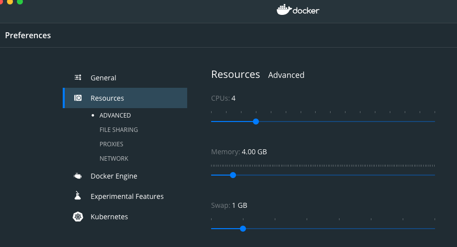
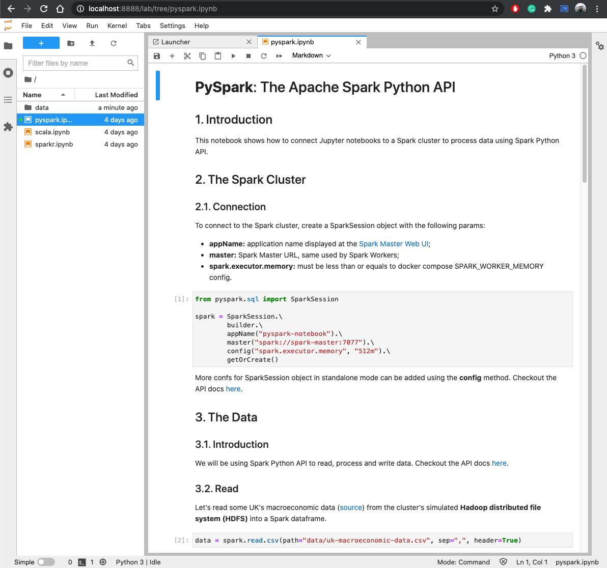
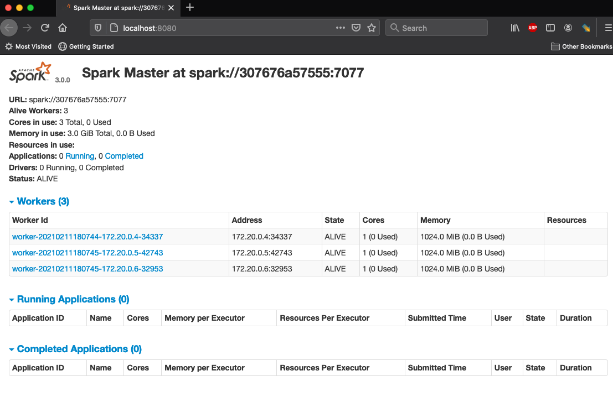

# Apache Spark Standalone Cluster on Docker

This standalone Spark cluster is adapted from **cluster-apps-on-docker/spark-standalone-cluster-on-docker**. Please follow these steps for a quick deployment of the cluster in your local machine.


## Introduction

This project gives you an **Apache Spark** cluster in a standalone mode with a **JupyterLab** interface built on top of **Docker**.
You can work with Apache Spark through its **Scala** or **Python** (PySpark) API by running the Jupyter [notebooks](build/workspace/) with examples on how to read, process and write data.

### Prerequisites: Docker Installation

Install Docker in your local machine [Docker](https://docs.docker.com/get-docker/). After the installation is complete, launch the 'Docker' application that will start the Docker service (e.g., Whale-like icon on your Mac status bar). If this step is successful, you should be able to type 'docker' on your command line console. 

Install [Docker Compose](https://docs.docker.com/compose/install/). Make sure that you provide ample resources to Docker. Otherwise, the JupyterLab Notebook won't be able to connect to the Spark Master. 

 
<p align="center"></p>

## Deploying Spark Standalone Cluster using Docker


### Step 1:
Download this repository.

### Step 2: Starting the cluster using Docker-Compose
Go to the ``cs5614-hw`` directory and start the cluster with the following command.

```bash
docker-compose up
```

This command will initiate the cluster using the recipe `docker-compose.yml`. 


```bash
Creating network "cs5614-hw_default" with the default driver
Creating spark-master ... done
Creating jupyterlab   ... done
Creating spark-worker-2 ... done
Creating spark-worker-1 ... done
Attaching to jupyterlab, spark-master, spark-worker-1, spark-worker-2
jupyterlab        | [W 2021-02-15 18:26:43.274 LabApp] 'token' has moved from NotebookApp to ServerApp. This config will be passed to ServerApp. Be sure to update your config before our next release.
jupyterlab        | [I 2021-02-15 18:26:43.282 ServerApp] jupyterlab | extension was successfully linked.
jupyterlab        | [I 2021-02-15 18:26:43.293 ServerApp] Writing notebook server cookie secret to /root/.local/share/jupyter/runtime/jupyter_cookie_secret
jupyterlab        | [I 2021-02-15 18:26:43.508 ServerApp] nbclassic | extension was successfully linked.
jupyterlab        | [W 2021-02-15 18:26:43.547 ServerApp] All authentication is disabled.  Anyone who can connect to this server will be able to run code.
jupyterlab        | [I 2021-02-15 18:26:43.553 LabApp] JupyterLab extension loaded from /usr/local/lib/python3.7/dist-packages/jupyterlab
jupyterlab        | [I 2021-02-15 18:26:43.553 LabApp] JupyterLab application directory is /usr/local/share/jupyter/lab
jupyterlab        | [I 2021-02-15 18:26:43.558 ServerApp] jupyterlab | extension was successfully loaded.
jupyterlab        | [I 2021-02-15 18:26:43.570 ServerApp] nbclassic | extension was successfully loaded.
jupyterlab        | [I 2021-02-15 18:26:43.571 ServerApp] Serving notebooks from local directory: /opt/workspace
jupyterlab        | [I 2021-02-15 18:26:43.572 ServerApp] Jupyter Server 1.3.0 is running at:
jupyterlab        | [I 2021-02-15 18:26:43.572 ServerApp] http://75c9bfe3cd9c:8888/lab
jupyterlab        | [I 2021-02-15 18:26:43.572 ServerApp]  or http://127.0.0.1:8888/lab
jupyterlab        | [I 2021-02-15 18:26:43.573 ServerApp] Use Control-C to stop this server and shut down all kernels (twice to skip confirmation).
jupyterlab        | [W 2021-02-15 18:26:43.577 ServerApp] No web browser found: could not locate runnable browser.
spark-master      | Using Spark's default log4j profile: org/apache/spark/log4j-defaults.properties
spark-master      | 21/02/15 18:26:44 INFO Master: Started daemon with process name: 9@b64ed1e31ca5
spark-master      | 21/02/15 18:26:44 INFO SignalUtils: Registered signal handler for TERM
spark-master      | 21/02/15 18:26:44 INFO SignalUtils: Registered signal handler for HUP
spark-master      | 21/02/15 18:26:44 INFO SignalUtils: Registered signal handler for INT
spark-worker-2    | Using Spark's default log4j profile: org/apache/spark/log4j-defaults.properties
spark-worker-2    | 21/02/15 18:26:44 INFO Worker: Started daemon with process name: 7@d942a0832f89
spark-worker-2    | 21/02/15 18:26:44 INFO SignalUtils: Registered signal handler for TERM
spark-worker-2    | 21/02/15 18:26:44 INFO SignalUtils: Registered signal handler for HUP
spark-worker-2    | 21/02/15 18:26:44 INFO SignalUtils: Registered signal handler for INT
spark-master      | 21/02/15 18:26:44 WARN NativeCodeLoader: Unable to load native-hadoop library for your platform... using builtin-java classes where applicable
```


Give this step a few seconds to set up everything and start all the nodes.

### Step 3: Access Jupyterlab, Master Node, and Driver Node 

Visit [localhost:8888](http://localhost:8888/) and run Apache Spark code using the provided Jupyter [notebooks](build/workspace/) with Scala, PySpark and SparkR examples.  
  <p align="center"></p>
  
- You can also monitor the cluster's health at  Spark Master [localhost:8080](http://localhost:8080/)  
  <p align="center"></p>
  
- Once you launch an application throught the notebook (e.g., via `collect()`), you can go to [localhost:4040](http://localhost:4040) to see the progress of the job and other infomration about the current job such as tasks, stages, application DAG, etc. 

### Cluster overview

| Application     | URL                                      | Description                                                |
| --------------- | ---------------------------------------- | ---------------------------------------------------------- |
| JupyterLab      | [localhost:8888](http://localhost:8888/) | Cluster interface with built-in Jupyter notebooks          |
| Spark Driver    | [localhost:4040](http://localhost:4040/) | Spark Driver web ui                                        |
| Spark Master    | [localhost:8080](http://localhost:8080/) | Spark Master node                                          |
| Spark Worker I  | [localhost:8081](http://localhost:8081/) | Spark Worker node with 1 core and 512m of memory (default) |
| Spark Worker II | [localhost:8082](http://localhost:8082/) | Spark Worker node with 1 core and 512m of memory (default) |


### Step 4: Shutting Down the Cluster
Use the following command to shutdown the cluster. Make sure you have transferred all the important data from the containers to the host machine. Otherwise the data lying on the containers will be lost
` docker-compose stop`


### Step 5: Restart the Cluster
Run step 2 to restart the cluster.
